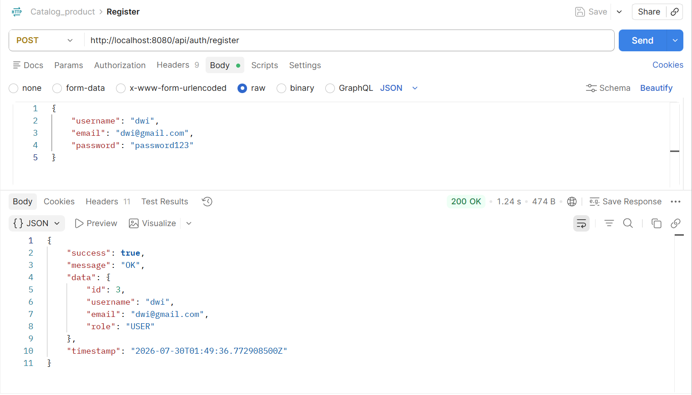
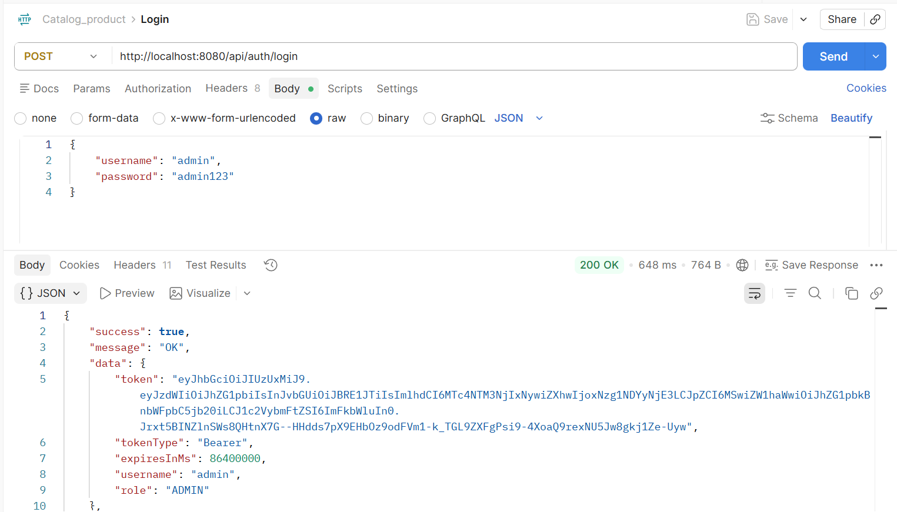
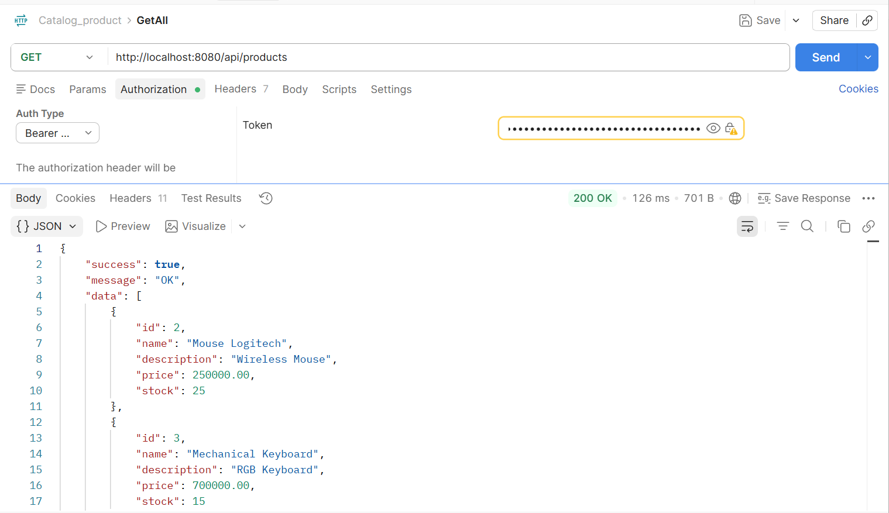
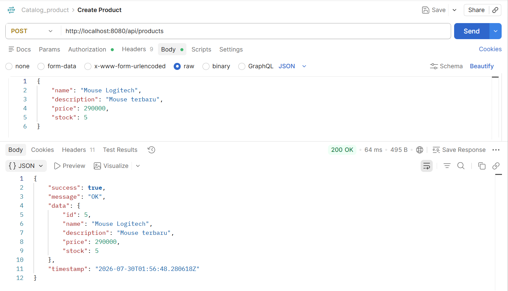
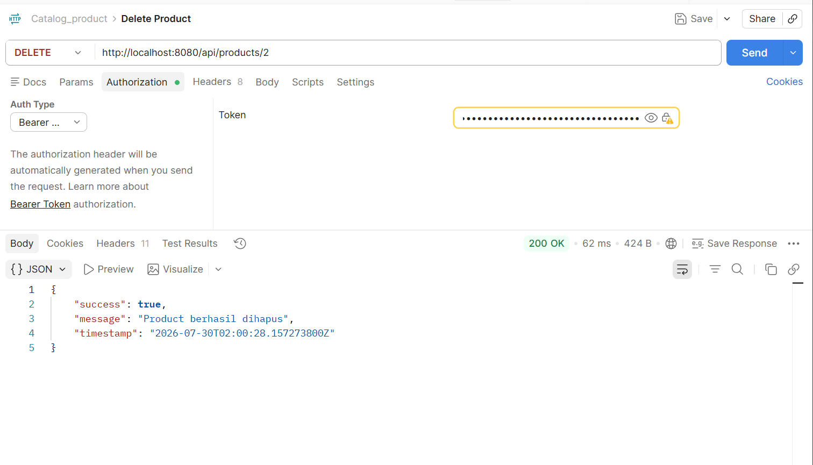

# Product Catalog API

Product Catalog Service is a RESTful API built with Spring Boot that provides user authentication using JWT and product management features with Spring Cache to improve data retrieval performance.

## Features

- JWT Authentication (Register & Login)
- Role-Based Authorization (ADMIN & USER)
- Product CRUD (Create, Read, Update, Delete)
- Soft Delete for Products
- Spring Cache (ConcurrentMapCacheManager)
- MySQL Database
- Data Seeder

---

## Tech Stack

- Java 17
- Spring Boot 4.1.0
- Spring Security
- Spring Data JPA
- Spring Cache
- JWT (JJWT)
- MySQL
- Maven
- Lombok

---

## Project Structure

```
src
├── config
├── controller
├── dto
│   ├── request
│   └── response
├── entity
├── enumeration
├── repository
├── service
│   └── impl
├── utils
└── ProductcatalogApplication.java
```

---

## Getting Started

### 1. Clone Repository

```bash
git clone https://github.com/anggrainyanggi40-bot/productcatalog-api.git
```

### 2. Open Project

Open the project using IntelliJ IDEA or Visual Studio Code.

### 3. Configure Database

Create a MySQL database.

Example:

```sql
CREATE DATABASE product_catalog;
```

Update the database configuration in:

```
src/main/resources/application.yml
```

Example:

```yaml
spring:
  datasource:
    url: jdbc:mysql://localhost:3306/product_catalog
    username: root
    password: your_password
```

### 4. Run Application

Using Maven:

```bash
mvn spring-boot:run
```

or simply run:

```
ProductcatalogApplication.java
```

---

## Default Seeder Account

### Admin

```
Username : admin
Password : admin123
```

### User

```
Username : user
Password : user123
```

---

## Authentication

### Register

```
POST /api/auth/register
```

### Login

```
POST /api/auth/login
```

Login will return a JWT Token.

Example Header:

```
Authorization: Bearer <your_token>
```

---

## Product API

### Get All Products

```
GET /api/products
```

### Get Product By Id

```
GET /api/products/{id}
```

### Create Product

```
POST /api/products
```

Example Body

```json
{
  "name": "Laptop ASUS",
  "description": "Gaming Laptop",
  "price": 18000000,
  "stock": 10
}
```

### Update Product

```
PUT /api/products/{id}
```

### Delete Product

```
DELETE /api/products/{id}
```

This project uses **Soft Delete**, so deleted products are marked as deleted instead of being permanently removed from the database.

---

## API Testing

### Register



### Login



### Get All Products



### Create Product



### Update Product


### Delete Product



## Spring Cache

This project uses **ConcurrentMapCacheManager** as the cache provider.

Implemented annotations:

| Method            | Cache Annotation |
| ----------------- | ---------------- |
| Get All Products  | @Cacheable       |
| Get Product By Id | @Cacheable       |
| Create Product    | @CacheEvict      |
| Update Product    | @CachePut        |
| Delete Product    | @CacheEvict      |

The cache helps reduce database queries by storing frequently accessed product data in memory.

---

## Performance Comparison

| Scenario      | Description                           |
| ------------- | ------------------------------------- |
| First Request | Data is retrieved from MySQL Database |
| Next Requests | Data is retrieved from Spring Cache   |

Using Spring Cache significantly reduces repeated database access and improves response time for frequently requested data.

---

## Testing

All endpoints have been tested successfully using **Postman**.

Tested APIs:

- Register
- Login
- Get All Products
- Get Product By Id
- Create Product
- Update Product
- Delete Product

---

## Author

**Dwi Pangestu Anggrainy**

Bootcamp Fullstack Web Development
